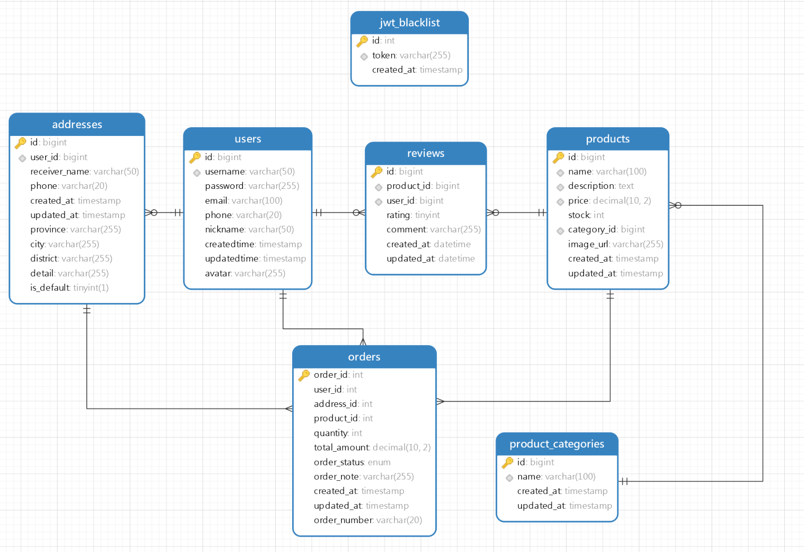

# 活力优选线上购物商城 - 数据库设计文档

## 1. 数据库概述

### 1.1 数据库基本信息
- 数据库名称：online_shopping_mall
- 字符集：utf8mb4
- 排序规则：utf8mb4_unicode_ci

```sql
CREATE DATABASE IF NOT EXISTS online_shopping_mall 
DEFAULT CHARACTER SET utf8mb4 
COLLATE utf8mb4_unicode_ci;

USE online_shopping_mall;
```



### 1.2 模块划分

1. 用户模块
   - 用户基本信息
   - 收货地址管理
   - JWT Token管理
2. 商品模块
   - 商品信息
   - 商品分类
3. 订单模块
   - 订单信息
4. 评价模块
   - 商品评价

## 2. 表设计详情

### 2.1 用户模块

#### 2.1.1 用户表（users）

| 字段名      | 类型         | 允许空 | 默认值            | 键   | 说明                                           |
|------------|--------------|--------|------------------|------|-----------------------------------------------|
| id         | BIGINT       | 否     | AUTO_INCREMENT   | PK   | 用户主键                                       |
| username   | VARCHAR(50)  | 否     | -                | UQ   | 用户名，唯一                                   |
| password   | VARCHAR(255) | 否     | -                | -    | 加密后的密码                                   |
| email      | VARCHAR(100) | 是     | NULL             | -    | 邮箱                                          |
| phone      | VARCHAR(20)  | 是     | NULL             | -    | 手机号                                        |
| nickname   | VARCHAR(50)  | 是     | NULL             | -    | 昵称                                          |
| avatar     | VARCHAR(255) | 否     | 默认头像URL        | -    | 用户头像URL                                   |
| createdtime| TIMESTAMP    | 否     | CURRENT_TIMESTAMP | -    | 创建时间                                       |
| updatedtime| TIMESTAMP    | 否     | CURRENT_TIMESTAMP | -    | 更新时间                                       |

```sql
CREATE TABLE users (
    id          BIGINT AUTO_INCREMENT COMMENT '用户主键'
        PRIMARY KEY,
    username    VARCHAR(50)                                                                                                               NOT NULL COMMENT '用户名',
    password    VARCHAR(255)                                                                                                              NOT NULL COMMENT '加密后的密码',
    email       VARCHAR(100)                                                                                                              NULL COMMENT '邮箱',
    phone       VARCHAR(20)                                                                                                               NULL COMMENT '手机号',
    nickname    VARCHAR(50)                                                                                                               NULL COMMENT '昵称',
    createdtime TIMESTAMP    DEFAULT CURRENT_TIMESTAMP                                                                                    NOT NULL COMMENT '创建时间',
    updatedtime TIMESTAMP    DEFAULT CURRENT_TIMESTAMP                                                                                    NOT NULL ON UPDATE CURRENT_TIMESTAMP COMMENT '更新时间',
    avatar      VARCHAR(255) DEFAULT 'https://online-shopping-mall.oss-cn-chengdu.aliyuncs.com/a76a37e3-0b60-4632-9ba1-1e4849e2aa7d..jpg' NOT NULL,
    CONSTRAINT uniq_username
        UNIQUE (username)
) COMMENT '用户表' CHARSET = utf8mb4;
```

#### 2.1.2 收货地址表（addresses）

| 字段名        | 类型         | 允许空 | 默认值            | 键   | 说明                                           |
|--------------|--------------|--------|------------------|------|-----------------------------------------------|
| id           | BIGINT       | 否     | AUTO_INCREMENT   | PK   | 地址主键                                       |
| user_id      | BIGINT       | 否     | -                | FK   | 用户ID，关联users表                            |
| receiver_name| VARCHAR(50)  | 否     | -                | -    | 收货人姓名                                     |
| phone        | VARCHAR(20)  | 否     | -                | -    | 收货人电话                                     |
| province     | VARCHAR(255) | 否     | ''               | -    | 省份                                          |
| city         | VARCHAR(255) | 否     | ''               | -    | 城市                                          |
| district     | VARCHAR(255) | 否     | ''               | -    | 区县                                          |
| detail       | VARCHAR(255) | 否     | ''               | -    | 详细地址                                       |
| is_default   | TINYINT(1)   | 否     | 0                | -    | 是否默认地址（0：否，1：是）                     |
| created_at   | TIMESTAMP    | 是     | CURRENT_TIMESTAMP | -    | 创建时间                                       |
| updated_at   | TIMESTAMP    | 是     | CURRENT_TIMESTAMP | -    | 更新时间                                       |

```sql
CREATE TABLE addresses (
    id            BIGINT AUTO_INCREMENT COMMENT '地址主键'
        PRIMARY KEY,
    user_id       BIGINT                                 NOT NULL COMMENT '用户 ID',
    receiver_name VARCHAR(50)                            NOT NULL COMMENT '收货人姓名',
    phone         VARCHAR(20)                            NOT NULL COMMENT '收货人电话',
    created_at    TIMESTAMP    DEFAULT CURRENT_TIMESTAMP NULL COMMENT '创建时间',
    updated_at    TIMESTAMP    DEFAULT CURRENT_TIMESTAMP NULL ON UPDATE CURRENT_TIMESTAMP COMMENT '更新时间',
    province      VARCHAR(255) DEFAULT ''                NOT NULL,
    city          VARCHAR(255) DEFAULT ''                NOT NULL,
    district      VARCHAR(255) DEFAULT ''                NOT NULL,
    detail        VARCHAR(255) DEFAULT ''                NOT NULL,
    is_default    TINYINT(1)   DEFAULT 0                 NOT NULL,
    CONSTRAINT fk_addresses_user_id
        FOREIGN KEY (user_id) REFERENCES users (id)
            ON DELETE CASCADE
) COMMENT '收货地址表' CHARSET = utf8mb4;

CREATE INDEX idx_user_id ON addresses (user_id);
```

#### 2.1.3 JWT黑名单表（jwt_blacklist）

| 字段名      | 类型         | 允许空 | 默认值            | 键   | 说明                                           |
|------------|--------------|--------|------------------|------|-----------------------------------------------|
| id         | INT          | 否     | AUTO_INCREMENT   | PK   | 主键                                          |
| token      | VARCHAR(255) | 是     | NULL             | UQ   | JWT Token                                     |
| created_at | TIMESTAMP    | 是     | CURRENT_TIMESTAMP | -    | 加入黑名单时间                                 |

```sql
CREATE TABLE jwt_blacklist (
    id         INT AUTO_INCREMENT
        PRIMARY KEY,
    token      VARCHAR(255)                        NULL,
    created_at TIMESTAMP DEFAULT CURRENT_TIMESTAMP NULL COMMENT '加入黑名单时间',
    CONSTRAINT uniq_token
        UNIQUE (token)
) COMMENT 'JWT 黑名单表' CHARSET = utf8mb4;
```

### 2.2 商品模块

#### 2.2.1 商品分类表（product_categories）

| 字段名      | 类型         | 允许空 | 默认值            | 键   | 说明                                           |
|------------|--------------|--------|------------------|------|-----------------------------------------------|
| id         | BIGINT       | 否     | AUTO_INCREMENT   | PK   | 分类主键                                       |
| name       | VARCHAR(100) | 否     | -                | UQ   | 分类名称                                       |
| created_at | TIMESTAMP    | 是     | CURRENT_TIMESTAMP | -    | 创建时间                                       |
| updated_at | TIMESTAMP    | 是     | CURRENT_TIMESTAMP | -    | 更新时间                                       |

```sql
CREATE TABLE product_categories (
    id         BIGINT AUTO_INCREMENT COMMENT '分类主键'
        PRIMARY KEY,
    name       VARCHAR(100)                        NOT NULL COMMENT '分类名称',
    created_at TIMESTAMP DEFAULT CURRENT_TIMESTAMP NULL COMMENT '创建时间',
    updated_at TIMESTAMP DEFAULT CURRENT_TIMESTAMP NULL ON UPDATE CURRENT_TIMESTAMP COMMENT '更新时间',
    CONSTRAINT name
        UNIQUE (name)
) COMMENT '商品分类表' CHARSET = utf8mb4;
```

#### 2.2.2 商品信息表（products）

| 字段名       | 类型          | 允许空 | 默认值            | 键   | 说明                                           |
|-------------|---------------|--------|------------------|------|-----------------------------------------------|
| id          | BIGINT        | 否     | AUTO_INCREMENT   | PK   | 商品主键                                       |
| name        | VARCHAR(100)  | 否     | -                | UQ   | 商品名称                                       |
| description | TEXT          | 是     | NULL             | -    | 商品描述                                       |
| price       | DECIMAL(10,2) | 否     | -                | -    | 商品价格                                       |
| stock       | INT           | 否     | -                | -    | 商品库存                                       |
| category_id | BIGINT        | 否     | -                | FK   | 商品分类ID                                     |
| image_url   | VARCHAR(255)  | 是     | NULL             | -    | 商品图片路径                                   |
| created_at  | TIMESTAMP     | 是     | CURRENT_TIMESTAMP | -    | 创建时间                                       |
| updated_at  | TIMESTAMP     | 是     | CURRENT_TIMESTAMP | -    | 更新时间                                       |

```sql
CREATE TABLE products (
    id          BIGINT AUTO_INCREMENT COMMENT '商品主键'
        PRIMARY KEY,
    name        VARCHAR(100)                        NOT NULL COMMENT '商品名称',
    description TEXT                                NULL COMMENT '商品描述',
    price       DECIMAL(10, 2)                      NOT NULL COMMENT '商品价格',
    stock       INT                                 NOT NULL COMMENT '商品库存',
    category_id BIGINT                              NOT NULL COMMENT '商品分类 ID',
    image_url   VARCHAR(255)                        NULL COMMENT '商品图片路径',
    created_at  TIMESTAMP DEFAULT CURRENT_TIMESTAMP NULL COMMENT '创建时间',
    updated_at  TIMESTAMP DEFAULT CURRENT_TIMESTAMP NULL ON UPDATE CURRENT_TIMESTAMP COMMENT '更新时间',
    CONSTRAINT name
        UNIQUE (name),
    CONSTRAINT fk_category
        FOREIGN KEY (category_id) REFERENCES product_categories (id)
            ON DELETE CASCADE
) COMMENT '商品信息表';

CREATE INDEX idx_category_id ON products (category_id);
CREATE FULLTEXT INDEX idx_name_description ON products (name, description);
CREATE INDEX idx_price ON products (price);
```

### 2.3 订单模块

#### 2.3.1 订单表（orders）

| 字段名        | 类型          | 允许空 | 默认值            | 键   | 说明                                           |
|--------------|---------------|--------|------------------|------|-----------------------------------------------|
| order_id     | INT           | 否     | AUTO_INCREMENT   | PK   | 订单主键                                       |
| user_id      | INT           | 否     | -                | FK   | 用户ID                                        |
| address_id   | INT           | 否     | -                | FK   | 收货地址ID                                     |
| product_id   | INT           | 否     | -                | FK   | 商品ID                                        |
| quantity     | INT           | 否     | -                | -    | 购买数量                                       |
| total_amount | DECIMAL(10,2) | 否     | -                | -    | 订单总金额                                     |
| order_status | ENUM          | 否     | -                | -    | 订单状态（未支付，已支付）                       |
| order_note   | VARCHAR(255)  | 是     | '未备注'         | -    | 订单备注                                       |
| order_number | VARCHAR(20)   | 否     | -                | -    | 订单号                                        |
| created_at   | TIMESTAMP     | 是     | CURRENT_TIMESTAMP | -    | 创建时间                                       |
| updated_at   | TIMESTAMP     | 是     | CURRENT_TIMESTAMP | -    | 更新时间                                       |

```sql
CREATE TABLE orders (
    order_id     INT AUTO_INCREMENT
        PRIMARY KEY,
    user_id      INT                                    NOT NULL,
    address_id   INT                                    NOT NULL,
    product_id   INT                                    NOT NULL,
    quantity     INT                                    NOT NULL,
    total_amount DECIMAL(10, 2)                         NOT NULL,
    order_status ENUM ('未支付', '已支付')              NOT NULL,
    order_note   VARCHAR(255) DEFAULT '未备注'          NULL,
    created_at   TIMESTAMP    DEFAULT CURRENT_TIMESTAMP NULL,
    updated_at   TIMESTAMP    DEFAULT CURRENT_TIMESTAMP NULL ON UPDATE CURRENT_TIMESTAMP,
    order_number VARCHAR(20)                            NOT NULL COMMENT '订单号'
);
```

### 2.4 评价模块

#### 2.4.1 评价表（reviews）

| 字段名      | 类型         | 允许空 | 默认值            | 键   | 说明                                           |
|------------|--------------|--------|------------------|------|-----------------------------------------------|
| id         | BIGINT       | 否     | AUTO_INCREMENT   | PK   | 评价主键                                       |
| product_id | BIGINT       | 否     | -                | FK   | 商品ID                                        |
| user_id    | BIGINT       | 否     | -                | FK   | 用户ID                                        |
| rating     | TINYINT      | 是     | 5                | -    | 评分（1-5星）                                  |
| comment    | VARCHAR(255) | 是     | '暂无评价'        | -    | 评价内容                                       |
| created_at | DATETIME     | 是     | CURRENT_TIMESTAMP | -    | 创建时间                                       |
| updated_at | DATETIME     | 是     | CURRENT_TIMESTAMP | -    | 更新时间                                       |

```sql
CREATE TABLE reviews (
    id         BIGINT AUTO_INCREMENT
        PRIMARY KEY,
    product_id BIGINT                                 NOT NULL,
    user_id    BIGINT                                 NOT NULL,
    rating     TINYINT      DEFAULT 5                 NULL,
    comment    VARCHAR(255) DEFAULT '暂无评价'        NULL,
    created_at DATETIME     DEFAULT CURRENT_TIMESTAMP NULL,
    updated_at DATETIME     DEFAULT CURRENT_TIMESTAMP NULL ON UPDATE CURRENT_TIMESTAMP,
    CONSTRAINT fk_review_product
        FOREIGN KEY (product_id) REFERENCES products (id),
    CONSTRAINT fk_review_user
        FOREIGN KEY (user_id) REFERENCES users (id)
            ON DELETE CASCADE
);
```

## 3. 表关系说明

### 3.1 一对多关系
1. 用户(users) -> 收货地址(addresses)
   - 一个用户可以有多个收货地址
   - 通过user_id外键关联
2. 商品分类(product_categories) -> 商品(products)
   - 一个分类可以包含多个商品
   - 通过category_id外键关联
3. 用户(users) -> 评价(reviews)
   - 一个用户可以发表多个评价
   - 通过user_id外键关联
4. 商品(products) -> 评价(reviews)
   - 一个商品可以有多个评价
   - 通过product_id外键关联

### 3.2 多对多关系
- 用户与商品之间通过订单表(orders)建立多对多关系
- 一个用户可以购买多个商品，一个商品可以被多个用户购买

## 4. 索引设计说明

### 4.1 主键索引
- 所有表都使用自增主键，提高插入性能和查询效率

### 4.2 唯一索引
1. users表：username字段
2. product_categories表：name字段
3. products表：name字段
4. jwt_blacklist表：token字段

### 4.3 外键索引
1. addresses表：user_id字段
2. products表：category_id字段
3. reviews表：product_id和user_id字段

### 4.4 普通索引
1. products表：
   - idx_price：针对商品价格的范围查询
   - idx_category_id：优化分类查询

### 4.5 全文索引
1. products表：
   - idx_name_description：优化商品名称和描述的全文搜索

## 5. 数据安全性设计

### 5.1 密码安全
- 用户密码使用BCrypt算法加密存储
- 密码字段长度设置为255，满足加密后的存储需求

### 5.2 Token安全
- 使用jwt_blacklist表存储已失效的Token
- Token具有唯一性约束，防止重复使用

### 5.3 数据完整性
- 使用外键约束确保数据关联的完整性
- 设置适当的默认值和非空约束
- 使用事务确保数据操作的原子性
